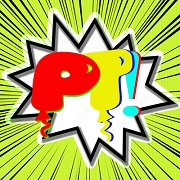

<h1 align="center">Welcome to PartyTime 👋</h1> 
<p>
  
  <a href="#" target="_blank">
    
  </a>
</p>

> PT e' una PWA creata e progettata per gli utenti che vogliono organizzare eventi o feste con animazione e spettacolo

### 🏠 [Homepage](https://github.com/KacchanEye/PartyTime)


## Tecnologies
This Project is create with:
* SqlAlchemy
* Python
* JavaScript
* HTML
* Css
* Flask

# Deploy
- Clone the Repository
```
git clone https://github.com/KacchanEye/PartyTime
```
- Move to the directory PartyTime and create an virtual environment for Python
```
python3 -m venv venv
```
- Install required libraries (see libreries.txt file)
```
pip install libreries.txt
```
- Move to the Flask folder and start the web server so that it can be reached on the whole local network
```
flask run --host 0.0.0.0
```
- to run it on local host only
```
flask run
```


## Author

👤 **Giuseppe Marano Renzo Cerqua Simone Liccardo Fabio Salese**

* Github: [@KacchanEye](https://github.com/KacchanEye)

## 🤝 Contributing

Contributions, issues and feature requests are welcome!<br />Feel free to check [issues page](https://github.com/KacchanEye/PartyTime/issues). 

## Show your support

Give a ⭐️ if this project helped you!


